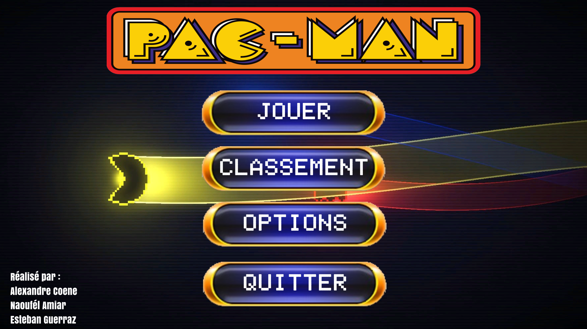
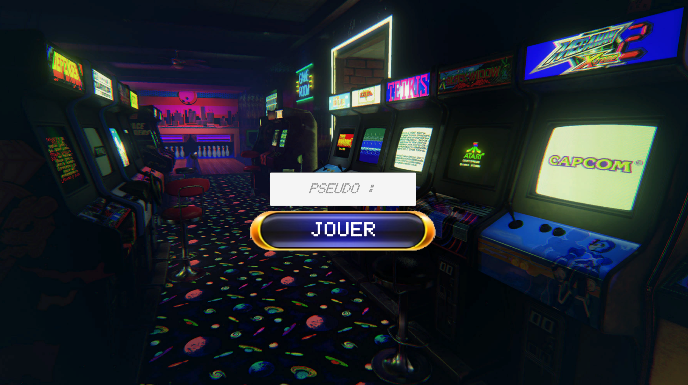
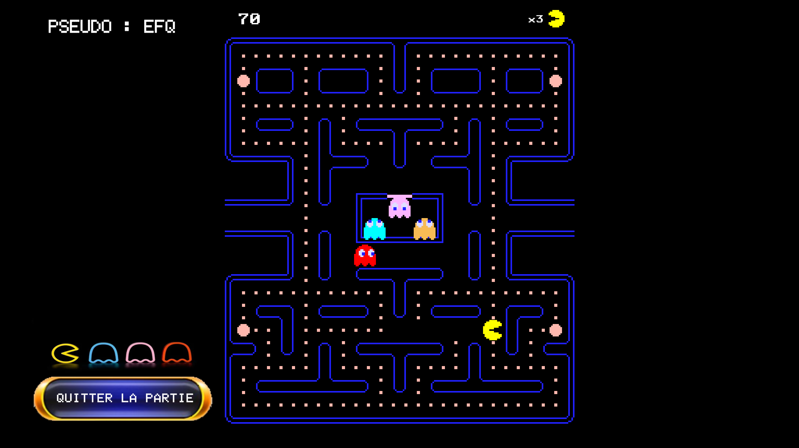

# 🟡 Pac-Man WPF  

Une recréation du classique **Pac-Man** développée en C# avec .NET WPF. Contrôlez Pac-Man, évitez les fantômes et collectez toutes les pac-gommes pour gagner !  

## 🎮 Fonctionnalités  

- 🕹️ Déplacement fluide de Pac-Man  
- 👻 IA des fantômes avec différents comportements  
- 🍒 Apparition d'objets bonus pour des points supplémentaires  
- 🎵 Effets sonores et ambiance fidèle au jeu original  
- 🎨 Graphismes recréés pour une expérience nostalgique  

## 🛠 Technologies utilisées  

- C#  
- .NET WPF  
- XAML pour l'interface graphique  
- Gestion des collisions et des déplacements  

## 📸 Aperçu  

### 🏠 Écran d'accueil  
  

### ✏️ Sélection du pseudo  
  

### 🎮 En jeu  
  

## 📝 Auteur  

- **Coene Alexandre** - [GitHub](https://github.com/AlexandreCoene)  
